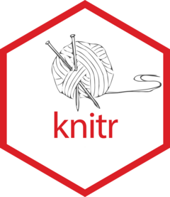

# knitr 

<!-- badges: start -->
[](https://github.com/yihui/knitr/actions/workflows/R-CMD-check.yaml)
[](https://github.com/yihui/knitr/actions/workflows/knitr-examples.yaml)
[](https://app.codecov.io/gh/yihui/knitr?branch=master)
[](https://cran.r-project.org/package=knitr)
<!-- badges: end -->

O pacote R **knitr** é um motor de programação literata (o *literate programming* de Donald Knuth) de propósito geral, com API's leves desenhadas para dar aos usuários controle total das saídas, sem trabalho pesado de codificação. Ele combina muitas funcionalidades em um único pacote com pequenos ajustes motivados pelo meu uso diário do Sweave. Vejam a [homepage](https://yihui.org/knitr/) do pacote para detalhes e exemplos. Vejam os [FAQ's](https://yihui.org/knitr/faq/) para uma lista de perguntas (incluindo sobre onde levantar questões).

## Instalação

Você pode instalar a versão estável em [CRAN](https://cran.r-project.org/package=knitr):

```r
install.packages('knitr')
```

Você pode instalar a versão em desenvolvimento em <https://yihui.r-universe.dev>, que fornece compilações (*builds*) diários do **knitr**:

```r
options(repos = c(
  yihui = 'https://yihui.r-universe.dev',
  CRAN = 'https://cloud.r-project.org'
))

install.packages('knitr')
```

## Motivação

Enquanto o Sweave e seus pacotes anexos como
[**cacheSweave**](https://cran.r-project.org/package=cacheSweave) e
[**pgfSweave**](https://cran.r-project.org/package=pgfSweave) são um motor 
de programação literata em R razoavelmente bom, eu freqüentemente sinto
minhas mãos estão atadas, por exemplo:

- Eu encarei o código fonte do Sweave e desejei por centenas de vezes 
  *se eu apenas pudesse inserir* `[width=.8\textwidth]` *entre*
  `\includegraphics` *e* `{meu-plot.pdf}` (a maneira oficial no Sweave é
  `\setkeys{Gin}` mas isso configura uma largura (*width*) global, o que
  não realista já que nós com freqüência temos de ajustar larguras
  indidualmente; Sim, você pode usar `\setkeys{Gin}` por muitas vezes,
  mas porquê não apenas prover uma opção por pedaço (*chunk*) de código?
- Eu desejei muitas vezes *se apenas eu pudesse usar outros dispositivos 
  gráficos outros que não PDF e postscript*; Agora o sonho se tornou real
  no R oficial, mas o que eu tinha esperanças é que fosse uma opção tão
  simples como `dev = 'png'` oi `dev  = 'CairoJPEG'`;
- Eu queria que múltiplos gráficos em um único pedaço de código pudesse
  ser registrado ao invés de apenas o último;
- Eu desejei que houvesse uma forma de arredondar os números em `\Sexpr{}`
  sem escrever expressões como `\Sexpr{round(x, 3)}` para *cada simples*
  `\Sexpr{}`;
- Eu desejava que eu não tivesse de escrever `print()` em gráficos do
  [**ggplot2**](https://cran.r-project.org/package=ggplot2) e um simples
  `qplot(x, y)` apenas me desse um gráfico plotado no Sweave;
- Eu deseje que usuários nunca precisassem de instruções sobre `Sweave.sty`
  ou entrasse em problemas devido ao fato que *LaTeX não consegue encontrar*
  `Sweave.sty`;
- Eu desejei que**cacheSweave** pudesse imprimir os resultados de um pedaço
  de código mesmo que ele estivesse em cache;
- Eu desejei que [**brew**](https://cran.r-project.org/package=brew) pudesse
  suportar gráficos;
- Eu desejei que [**R2HTML**](https://cran.r-project.org/package=R2HTML)
  pudesse suportar destaque de sintaxe (*syntax highlighting*) para código
  em R;
- ...


[](https://www.amazon.com/dp/1498716962/)

O pacote  **knitr** foi desenhado para dar ao usuário acesso à todas as partes do processo de lidar com um documento de programação literata, então não há
necessidade de hackear nenhum componente do núcleo se você quiser mais liberdade.
Eu atravessei o código fonte do **pgfSweave** e do **cacheSweave** algumas vezes,
e freqüentemente me sinto desconfortável com a quantidade de código copiada
da distribuição oficial do R, especialmente quando R tem uma nova versão lançada
(eu vou começar a me preocupar se os anexos - *add-ons* - estão atuais com o
Sweave oficial).

## Uso

```r
library(knitr)
?knit
knit(input)
```

Se as opções não forem explicitadas, **knitr** vai tentar adivinhar
configurações-padrão razoáveis. Alguns manuais estão disponíveis, como o
[manual principal](https://yihui.org/knitr/demo/manual/), e o [manual de gráficos](https://yihui.org/knitr/demo/graphics/). Para uma referência
organizada, ver o [livro do knitr](https://www.amazon.com/dp/1498716962/).

## Licença

Este pacote é software livre e de código aberto, licenciado sobre a GPL.

